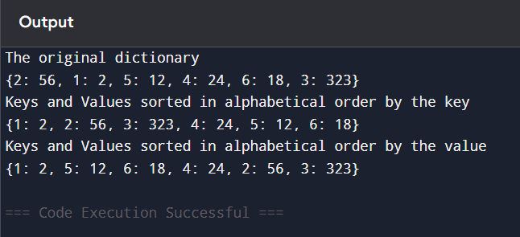

# 🔤 Dictionary-Python Program to Sort a Dictionary by Keys and Values

This Python program demonstrates how to sort a dictionary:
- Alphabetically by keys
- Alphabetically by values

## 🎯 Aim

To write a Python program that sorts a dictionary's:
- Keys in alphabetical order
- Values in alphabetical order

## 🧠 Algorithm

1. **Start the program.**
2. **Define** a dictionary with key-value pairs.
3. **Sort by Keys**:
   - Use `sorted(dictionary.items())`
   - Convert the result to a dictionary using `dict()`
4. **Sort by Values**:
   - Use `sorted(dictionary.items(), key=lambda item: item[1])`
   - Convert the result to a dictionary using `dict()`
5. **Display** the original and sorted dictionaries.
6. **End the program.**

## 🧪Program
```
dicto={2:56,1:2,5:12,4:24,6:18,3:323}
print("The original dictionary")
print(dicto)
d1=sorted(dicto.items())
print("Keys and Values sorted in alphabetical order by the key")
print(dict(d1))
d2=sorted(dicto.items(),key=lambda i:i[1])
print("Keys and Values sorted in alphabetical order by the value")
print(dict(d2))
```
## Sample Output

## Result
The python program to sort dictionaries by key-value pairs is executed successfully.
